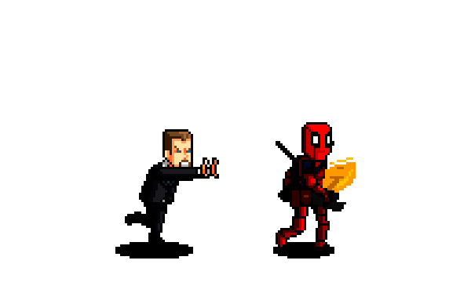

# 👋 Hey, I'm Aarush

> **xonas1101** | Cloud-Native Engineer | Maximum Effort Vibes

## 🚀 About Me

I'm a **cloud-native engineer** obsessed with **Kubernetes**. I don't just write code, I write *solutions*. Product design, QA, bug hunting, UI improvements — if it ships with quality, I'm all in.

**Philosophy:** *Maximum effort. No shortcuts.*

## 🤝 Let's Work Together

**Find me:** [@xonas1101](https://github.com/xonas1101)  
**Hit me up:** KubeStellar contributions, orchestration problems, or just vibes  
**Fair warning:** I don't do half measures

## 💬 Mantra

> *"Maximum effort"* — Always ship your best work, no exceptions

## 🎪 Fun Facts

- I can explain complex distributed systems in plain English
- Chimichangas are optional, but commitment isn't

---

### *"I'm gonna do what's called a pro coder move"*

*[commits to main with zero regrets]*

 
*Ready to ship: Always*

<!--
**xonas1101/xonas1101** is a ✨ _special_ ✨ repository because its `README.md` (this file) appears on your GitHub profile.

Here are some ideas to get you started:

- 🔭 I’m currently working on ...
- 🌱 I’m currently learning ...
- 👯 I’m looking to collaborate on ...
- 🤔 I’m looking for help with ...
- 💬 Ask me about ...
- 📫 How to reach me: ...
- 😄 Pronouns: ...
- ⚡ Fun fact: ...
-->
